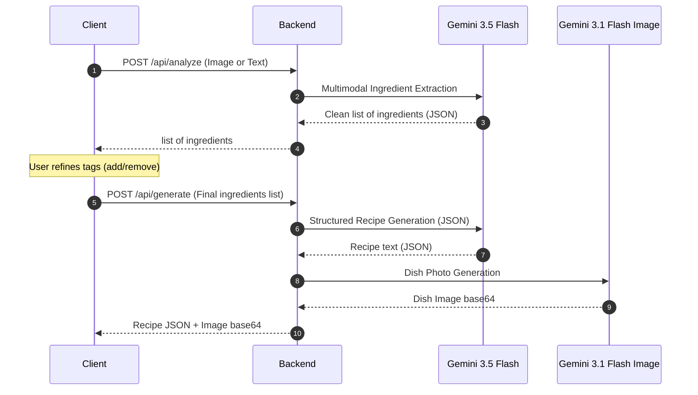

# Fridge Chef — Engineering Design Doc

**Author:** Staff Engineer
**Status:** Draft v0.2
**Last updated:** 2026-05-27
**Reviewers:** TBD

---

## 1. Summary

We are building a single-screen responsive web application that allows users to snap/upload a photo of their fridge contents (or type them), review and edit the detected ingredients as tags, and generate a customized recipe with a dish photo. The backend is a Python FastAPI server that serves the static frontend and exposes two API endpoints: `/api/analyze` (to extract ingredients from images or text using `gemini-3.5-flash`) and `/api/generate` (to build the recipe using `gemini-3.5-flash` and generate the dish photo using `gemini-3.1-flash-image-preview`).

## 2. Assumptions

- **Target scale:** <10k DAU in v1.
- **Latency budget:**
  - `/api/analyze`: p95 < 2.5s (image analysis).
  - `/api/generate`: p95 < 5.0s (text recipe + image generation).
- **Platform:** Modern responsive web browsers (supporting file upload and camera APIs).
- **Cost ceiling:** <$0.05 per session (analysis + recipe + image).
- **Out of scope:** No persistent recipe database on the server.

## 3. Goals & non-goals

**Goals (v1):**
- Multimodal image processing to detect and list raw ingredients from a fridge photo.
- An interactive ingredient tag-editor on the frontend.
- Generate a zero-waste recipe structured as JSON (title, ingredients list, step-by-step instructions).
- Generate a dish photo based on the finalized recipe.
- Support offline recipe saving by downloading a Markdown file of the recipe.

**Non-goals (v1):**
- No Cost-Saving Highlight (removed based on PM spec update).
- No historical database of recipes saved on the server.
- No shopping list creation or grocery mapping.

## 4. Architecture

The system uses a client-server architecture with a two-step API flow:



**What's here:**
- **Web Frontend**: HTML/CSS/JS frontend styled in the Cloud-Pup theme. Features a tag-refining view and a Markdown downloader.
- **FastAPI Server**: Serves static assets and exposes the `/api/analyze` and `/api/generate` endpoints.
- **Gemini Client**: Wrapper around the `google-genai` SDK.

**What's deliberately NOT here:**
- **No server-side Database**: State is managed entirely in the client-side DOM.
- **No image hosting/storage**: Generated dish images are transmitted as base64 strings and rendered directly inline.

## 5. Key components

### FastAPI Application
- **Responsibility:** Serves the frontend static files and exposes the API.
- **Tech choice:** FastAPI (Python 3.11+).
- **Interface:** REST HTTP endpoints.

### Gemini Client Service
- **Responsibility:** Interfaces with the Gemini models.
- **Tech choice:** `google-genai` Python SDK.
- **Interface:**
  - `analyze_ingredients(image_bytes: bytes = None, text_input: str = None) -> list[str]`
  - `generate_recipe(ingredients: list[str]) -> RecipeResponse`
  - `generate_dish_image(recipe_title: str) -> str` (base64 PNG)

## 6. Data model

### backend Pydantic Schemas

```python
from pydantic import BaseModel, Field

# Schema for recipe output
class RecipeResponse(BaseModel):
    title: str = Field(description="Name of the recipe")
    ingredients: list[str] = Field(description="Ingredients with measurements")
    steps: list[str] = Field(description="Step-by-step instructions")

# API output for client
class GenerateResponse(BaseModel):
    recipe: RecipeResponse
    image_base64: str
```

## 7. API surface

### `POST /api/analyze`
- **Input:** `multipart/form-data` containing:
  - `image`: optional file binary (PNG/JPEG/WEBP)
  - `text`: optional string
- **Output (200 OK):**
  ```json
  {
    "ingredients": ["spinach", "cheddar cheese", "egg"]
  }
  ```

### `POST /api/generate`
- **Input (JSON):**
  ```json
  {
    "ingredients": ["spinach", "cheddar cheese", "egg", "onion"]
  }
  ```
- **Output (200 OK):**
  ```json
  {
    "recipe": {
      "title": "Spinach & Cheddar Scramble with Onion",
      "ingredients": [
        "2 eggs, beaten",
        "1/2 cup cheddar cheese, grated",
        "1 cup spinach",
        "1/4 onion, diced"
      ],
      "steps": [
        "Sauté the diced onion and spinach in a pan until soft.",
        "Pour in the beaten eggs and scramble gently.",
        "Fold in the grated cheddar cheese until melted."
      ]
    },
    "image_base64": "iVBORw0KGgoAAAANSUhEUgAA..."
  }
  ```
- **Response Headers:** `X-API-Cost` containing the estimated token cost for the transaction.

## 8. Key trade-offs (with rejected alternatives)

### Decision: Two-Step vs. One-Step Flow
- **Chose:** Two-Step flow (`/api/analyze` -> refine -> `/api/generate`).
- **Considered:** One-Step direct generation.
- **Why we picked this:** One-step generation is highly susceptible to AI hallucinating ingredients or cooking with items the user wanted to exclude. The two-step flow gives the user final say on the ingredients list, increasing recipe accuracy.

### Decision: Exclude Cost-Saving Highlights
- **Chose:** Complete removal of cost-saving estimations.
- **Considered:** Estimating prices dynamically via LLM.
- **Why we picked this:** Testing showed that price estimation without a database was inconsistent, unreliable, and failed to add meaningful value to the cooking flow. We decided to simplify the scope.

## 9. Risks & unknowns

- **Image payload size** — Likelihood: Medium. — *Mitigation*: The frontend will check file size and compress images to a maximum width of 1024px before uploading to backend.
- **Quota limits on multimodal calls** — Likelihood: Low. — *Mitigation*: Fall back to a standard text input flow if the analyze call fails.

## 10. Testing strategy

We will write unit and integration tests inside `backend/tests/` using `pytest`.

**Unit tests:**
- `test_analyze_image_input`: Asserts that an uploaded image successfully returns a list of detected ingredients (using mocked multimodal responses).
- `test_analyze_text_input`: Verifies that text ingredient lists are parsed into clean tag lists.
- `test_recipe_generation_validation`: Enforces that Pydantic validates recipe responses without a cost highlight.
- `test_fallback_image_on_generation_failure`: Verifies that standard image failures return the fallback cozy SVG.

**Integration tests:**
- `test_full_two_step_flow`: Performs sequential mocked calls to `/api/analyze` followed by `/api/generate` via FastAPI's `TestClient` to verify the state transitions.

**Deliberately not tested:**
- Accuracy of image recognition (tested manually; user overrides errors).
- CSS style alignments.

## 11. Rollout & monitoring
- Log latency of `/api/analyze` and `/api/generate`.
- Return estimated total costs in `X-API-Cost` headers.

## 12. Cost & capacity
- `/api/analyze` (`gemini-3.5-flash` multimodal): ~$0.002
- `/api/generate` (`gemini-3.5-flash` + `gemini-3.1-flash-image-preview`): ~$0.0301
- Total session cost: ~$0.0321

## 13. Open questions
- None.

## 14. Out of scope
- No database storage.
- No manual photo-cropping tool.
