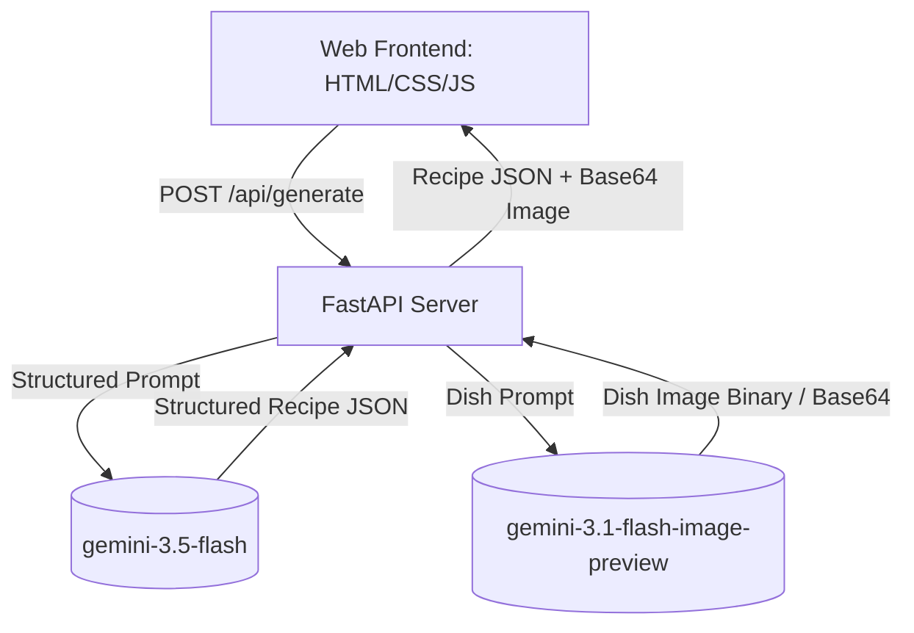

# Fridge Chef — Engineering Design Doc

**Author:** Staff Engineer
**Status:** Draft v0.1
**Last updated:** 2026-05-27
**Reviewers:** TBD

---

## 1. Summary

We are building a single-screen responsive web application that generates cost-saving recipes and dish photos from user-specified fridge ingredients. The backend is a Python FastAPI server that serves the static frontend files and exposes a single API endpoint `/api/generate`. It coordinates two sequential calls to the Google Gemini API using the new `google-genai` SDK: first, a structured JSON text generation call to `gemini-3.5-flash` for the recipe and cost estimation, and second, an image generation call to `gemini-3.1-flash-image-preview` to create a dish photo based on the generated recipe.

## 2. Assumptions

- **Target scale:** <10k DAU in v1. The application will be deployed as a single instance.
- **Latency budget:** p95 < 6s end-to-end (since image generation is relatively slow, we aim for <2s for text recipe and <3.5s for image).
- **Platform:** Modern responsive web browsers (desktop and mobile).
- **Cost ceiling:** <$0.05 per generation request. (Note: We will log the estimated API cost of each request in the server logs by tracking the input/output tokens for `gemini-3.5-flash` and the image count for `gemini-3.1-flash-image-preview`, using official pricing numbers, and return it in a custom `X-API-Cost` response header to easily verify and measure this constraint).
- **Out of scope:** No multi-turn chat, no user auth, and no persistent database storage for recipes on the server side.

## 3. Goals & non-goals

**Goals (v1):**
- Safely parse user text input into an ingredient list.
- Generate a delicious, contextual recipe structured as JSON (title, ingredients list, step-by-step instructions, cost-saving highlight).
- Generate a highly relevant, beautiful dish photo based on the recipe.
- Serve a responsive, high-performance HTML/CSS/JS frontend using the Cloud-Pup aesthetic.
- Handle API failures gracefully by returning placeholder images or cached illustrations.
- Allow users to download their generated recipe locally as a text file (e.g., Markdown format) to save offline.

**Non-goals (v1):**
- No user accounts or login systems (everything is anonymous).
- No historical database of recipes saved on the server (users download the recipe card locally or screenshot it to save offline).
- No shopping list creation or grocery mapping.

## 4. Architecture

The system uses a simple client-server architecture. The FastAPI backend serves static frontend files and proxies API calls to Gemini.



**What's here:**
- **Web Frontend**: A single-page static web application (HTML/CSS/JS) styled in the Cloud-Pup design system, mounted by the backend. Includes an offline save button to trigger a browser-level download of the recipe in Markdown.
- **FastAPI Server**: Python web server serving static assets and exposing the generation endpoint.
- **Gemini Client**: Wrapper around `google-genai` SDK that executes calls to Gemini models.

**What's deliberately NOT here:**
- **No server-side Database**: All state is transient. Recipes are delivered in the HTTP response and are not stored in any database. Users save recipes by downloading them locally.
- **No message queues**: Requests are processed synchronously. If the model fails or times out, the backend returns an error immediately.

## 5. Key components

### FastAPI Application
- **Responsibility:** Serves the frontend static files and exposes the API.
- **Tech choice:** FastAPI (Python 3.11+).
- **Why this choice:** Extremely fast, type-safe, simple to build and run with `uv`.
- **Interface:** HTTP REST API.

### Gemini Integration Service
- **Responsibility:** Authenticates and calls Gemini models for text and image generation.
- **Tech choice:** `google-genai` Python SDK.
- **Why this choice:** The official, standard SDK for the latest Gemini models.
- **Interface:**
  - `generate_recipe(ingredients: str) -> RecipeResponse`
  - `generate_dish_image(recipe_title: str, ingredients: list[str]) -> str` (returns base64 string)

## 6. Data model

The backend uses Pydantic to enforce the schema of the recipe response.

```python
from pydantic import BaseModel, Field

class RecipeResponse(BaseModel):
    title: str = Field(description="The name of the recipe")
    ingredients: list[str] = Field(description="List of ingredients with measurements")
    steps: list[str] = Field(description="Step-by-step cooking instructions")
    cost_saving_highlight: str = Field(description="An estimation of how much money or food waste was saved, e.g. 'Saved $7.50'")
```

The unified API response sent to the frontend:

```typescript
type GenerateAPIResponse = {
  recipe: {
    title: string;
    ingredients: string[];
    steps: string[];
    cost_saving_highlight: string;
  };
  image_base64: string; // The base64-encoded PNG image or fallback placeholder
};
```

## 7. API surface

### `POST /api/generate`

- **Input:**
  ```json
  {
    "ingredients": "stale bread, leftover cheddar cheese, wilted spinach"
  }
  ```
- **Output (200 OK):**
  ```json
  {
    "recipe": {
      "title": "Zero-Waste Spinach & Cheddar Sourdough Melt",
      "ingredients": [
        "2 slices of stale sourdough bread",
        "1/2 cup leftover cheddar cheese, grated",
        "1 cup wilted spinach",
        "1 tbsp butter or oil"
      ],
      "steps": [
        "Preheat a pan over medium heat.",
        "Sauté spinach in a little butter until fully wilted and set aside.",
        "Assemble the sandwich with cheddar and spinach between the bread slices.",
        "Toast in the pan for 3-4 minutes per side until golden brown and cheese is melted."
      ],
      "cost_saving_highlight": "Saved $6.20 by avoiding a cafe run!"
    },
    "image_base64": "iVBORw0KGgoAAAANSUhEUgAA..."
  }
  ```
- **Errors:**
  - `400 Bad Request`: If input is empty or too short.
  - `500 Internal Server Error`: If both Gemini calls fail, or client times out.
- **Latency budget:** p95 < 6s.

## 8. Key trade-offs (with rejected alternatives)

### Decision: Model Selection
- **Chose:** `gemini-3.5-flash` for recipe text and `gemini-3.1-flash-image-preview` for image generation.
- **Considered:** `gemini-3.1-pro-preview` for recipe, `gemini-3-pro-image-preview` for images.
- **Why we picked this:** `gemini-3.5-flash` has incredibly low latency and high cost-efficiency, which is perfect for generating simple recipes. `gemini-3.1-flash-image-preview` is optimized for high-volume developer use cases and is faster and cheaper than the Pro image model, allowing us to stay well within our latency budget.

### Decision: Sync vs. Async Image Generation
- **Chose:** Synchronous execution of text followed by image in one HTTP request.
- **Considered:** Returning the text recipe first, then having the frontend query a separate endpoint for the image asynchronously.
- **Why we picked this:** A single HTTP request keeps the frontend state machine simple (one loading state, one render). If image generation fails, the backend wraps it in a fallback illustration base64 string, so the client always gets a complete response.

## 9. Risks & unknowns

- **Image model rate limits or quotas** — Likelihood: Medium. — *Mitigation*: If the image model call fails (due to quota or safety filters), we return a pre-selected beautiful SVG placeholder illustration of a zero-waste recipe card instead of crashing.
- **Latency spike** — Likelihood: Medium. — *Mitigation*: Set explicit timeouts of 2s for the text call and 3.5s for the image call. If the image call times out, fallback immediately.

## 10. Testing strategy

We will implement automated tests in the `backend/tests/` directory using `pytest`.

**Unit tests:**
- `test_parse_ingredients`: Asserts that dirty or weird user inputs are successfully cleaned/passed to the API safely.
- `test_recipe_response_validation`: Enforces that the Pydantic schema parses and validates Gemini's output successfully, even if Gemini outputs minor markdown formatting bugs.
- `test_fallback_image_on_failure`: Verifies that when the image generation service throws an exception, the system returns a fallback base64 string containing the placeholder graphic.

**Integration tests (one per happy path):**
- `test_successful_generation_flow`: Mock the Gemini API client response and perform a full test of the `/api/generate` API using FastAPI's `TestClient` to ensure the response structure is correct and returns the correct status code.

**Deliberately not tested (and why):**
- Live Gemini API endpoints in the test suite (we mock them to save api cost and guarantee test speed/repeatability).
- Visual HTML alignment of the frontend (verified manually by the developer and validated by browser subagents).

## 11. Rollout & monitoring

- **Rollout:** Local verification first, then deploy using standard Uvicorn host mapping.
- **Monitoring:** Log generation times and log specific fallback counts (how often the image generator fails).
- **Rollback:** Simple server rollout rollback to previous Git hash.

## 12. Cost & capacity

- **Per-user cost:**
  - `gemini-3.5-flash` (Input: ~1000 tokens, Output: ~200 tokens): ~$0.0001
  - `gemini-3.1-flash-image-preview` (1 image generation): ~$0.03
  - Total per-user cost: ~$0.0301 per recipe generated.
- **Monthly budget at v1 scale (1,000 requests/month):** ~$30.00.
- **What breaks at 10x scale:** Gemini API keys could hit quota limit. We would mitigate this by caching common ingredients lists or adding rate-limiting headers.

## 13. Open questions

- [ ] Does the `gemini-3.1-flash-image-preview` model require a billing account to generate images? (Owner: PM/Eng to verify API key capabilities).

## 14. Out of scope (will not do)

- **No Auth / Session cookies** — The app does not save any cookie state.
- **No Custom Image Prompts** — The user cannot influence the photo styling; it is locked to a clean, organic food photography style.
